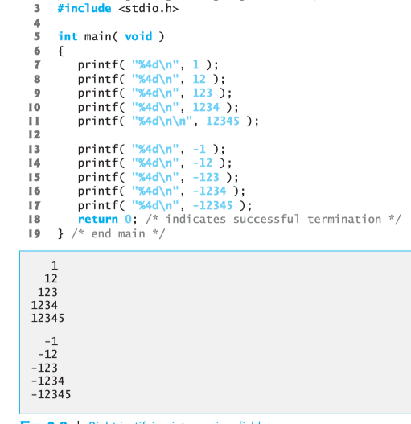
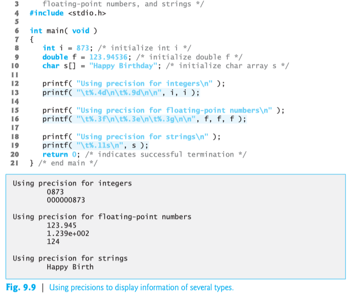

### Printing Integer

| Specifier | Description |
| :- | :- |
| i | signed int |
| d | signed int |
| u | unsigned int |
| o | unsigned octal int |
| x or X | unsigned hexa, x noncapital, X capital |
| h or l | short or long integer, adding before above specifier.

### Printing Float

| Specifier | Description |
| :- | :- |
| e or E | exponential notation |
| f | fixed point notation |
| g or G | either f or e form, based on magnitude. g: e^, G e^ |
| L | long double float, adding before |

### Printing Strings & Characters
`'%c'` requires a `char` argument.
`'%s'` requires a **pointer** to `char` as an argument.
`%s` prints until `'\0'` character is encountered.
### Other specifier
`'%p'` displays pointer value.  
`'%%'` displays `%`.  
`'%n'` counts number printed characters, then stores it to a variable `c` using `&c`. 

```c
printf("12345%n, &c);
printf("Number printed characters: %d", c);
```
```
> 12345
> Number printed characters: 5
```
### Printing with Field Width & Precision

Right justifying integers:



Using precision for floating-point numbers  



### Using Flag with `printf()`
#### `-` and `+`
    printf( "%10s%10d%10c%10f\n\n", "hello", 7, 'a', 1.23 );
    printf( "%-10s%-10d%-10c%-10f\n", "hello", 7, 'a', 1.23 );
    >     hello         7         a   1.230000
    >hello     7         a         1.230000
#### `(space)`

#### `#`

#### `0`

### Numbers are read seperately by `'-'`
```
scanf("%d-%d-%d-%d, a, b, c, d);
<23-4-4-60
>a: 23, b: 4, c: 4, d: 60
```

### Scanset specifier: ```%[]``` 

Read only capital letters to character array ```str```, until noncapital letter [A-Z] appear then stop reading.  
```c
scanf("%[A-Z]s", str);
```
```
>Enter: GEEKs_for_geeks
>You entered: GEEK
```
Read input until 'a' appear, then stop reading.
```c
scanf("%[^a]s", str);
```
```
>Enter a string: geeks for geeks
>You entered: geeks
```
gets() function reads a line from stdin into the buffer pointed to by s until either a terminating newline or EOF found.